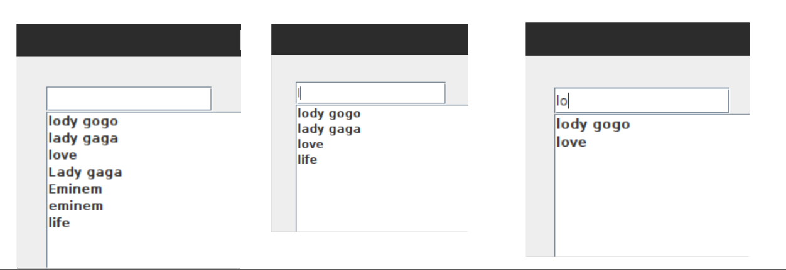

# Song Search Engine :notes:

To pretrained Word2Vec model που χρησιμοποιήθηκε: https://drive.google.com/u/1/uc?id=0B7XkCwpI5KDYNlNUTTlSS21pQmM&export=download&resourcekey=0-wjGZdNAUop6WykTtMip30g

Τα CSV αρχεία που χρησιμοποιήθηκαν για το dataset: 

### 🟣 Εισαγωγή 

Η εργασία αφορά στο σχεδιασμό και υλοποίηση ενός συστήματος αναζήτησης στίχων τραγουδιών και άλλης πληροφορίας σχετικής με μουσικούς και τραγούδια. Για την υλοποίηση θα χρησιμοποιηθεί η βιβλιοθήκη [Lucene](https://lucene.apache.org/), μια βιβλιοθήκη ανοικτού κώδικα για την κατασκευή μηχανών αναζήτησης κειμένου.
Η πρώτη φάση αποτελείται από τη συλλογή των δεδομένων η οποία πραγματοποιήθηκε με τη βοήθεια του Kaggle και περιγράφεται παρακάτω στην πρώτη ενότητα.


Η μηχανή αναζήτησης υποστηρίζει:

   * Αναζήτηση με λὲξεις κλειδία
    
   * Αναζήτηση σε πεδία
    
   * Σημασιολογική αναζήτηση με χρήση pretrained model(Word2Vec)
    
   * Ομαδοποίηση αποτελεσμάτων με βάση το πεδίο “Year”
    
   * Διόρθωση τυπογραφικών λαθών
   
   * Εναλλακτικά ερωτήματα με βάση το ιστορικό αναζήτησης
   
   * Εμφάνιση εως 10 αποτελεσμάτων ανα σελίδα
    
   * Highlighting των σχετικών αποτελεσμάτων
    
   

 Για την πραγματοποίηση της εφαρμογής δημιουργήθηκαν τα εξής πακέτα με τις αντίστοιχες κλάσεις τους:
    
   #### Org:
    
   `LuceneGUI.java`: Δημιουργία του κεντρικού παραθύρου του User Interface για την αλληλεπίδραση της εφαρμογής με τον χρήστη.
    
   #### Org.Constants:
    
   • `LuceneConstants.java`: Καθορισμός σταθερών που θα χρησιμοποιηθούν για την ανάκτηση/αποθήκυεση πληροφοριών, όπως είναι τα path των ευρετηρίων, του pretrained model και της συλογής δεδομένων.
    
   #### Org.Indexer:
    
   • `Indexer.java`(Interface): Αναφορά των κοινών και βασικών συναρτήσεων που υλοποιούν οι δύο διαφορετικοί Analyzers για την δημιουργία των ευρετηρίων(createIndexer(),close()).
    
   • `StandardIndexerImpl.java`(implements Indexer): Υλοποίηση Interface,δημιουργία ευρετηρίου με χρήση του StandardAnalyzer() για αναζήτηση σε πεδία, καθώς και αναπαράσταση των λέξεων ως διανύσματα, για την υποστήριξη σημασιολογικής αναζήτης.
    
   • `KeywordIndexerImpl.java`(implements Indexer): Υλοποίηση Interface, δημιουργία ευρετηρίου με χρήση του KeywordAnalyzer() για αναζήτηση λέξεων-κλειδιών σε όλα τα πεδία.
    
   • `Helper.java`: Υλοποίηση βοηθητικών συναρτήσεων για επεξεργασία κειμένου και εκτύπωση των ονομάτων των πεδίων με σκοπό έλεγχου.
    
   #### Org.Searcher:
    
   • `Searcher.java`(Interface): Αναφορά των κοινών και βασικών συναρτήσεων που υλοποιούν οι δύο διαφορετικοί Analyzers για την πραγματοποίηση της αναζήτησης. 
    
   • `KeywordSearcherImpl.java`(implements Searcher): Υλοποίηση Interface,υλοποίηση αναζήτησης λέξεων-κλειδιών, ομαδοποίηση βάση συγκεκριμένου πεδίου.
    
   • `StandardSearcherImpl.java`(imlements Searcher)): Υλοποίηση Interface,υλοποίηση αναζήτησης σε πεδία που επιλέγει ο χρήστης, ομαδοποίηση βάση συγκεκριμένου πεδίου.
    
   • `SemanticSearcherImpl.java`(imlements Searcher)): Υλοποίηση Interface,υλοποίηση σημασιολογικής αναζήτησης σε πεδία που επιλέγει ο χρήστης, ομαδοποίηση βάση συγκεκριμένου πεδίου.
    
   • `History.java`: Υλοποίηση βοηθητικής συνάρτησης για την διατήρηση του ιστορικού αναζήτησης του χρήστη, με σκοπό στην επόμενη αναζήτηση να του προταθεί κάποιο εναλλακτικό ερώτημα.
    
   • `Helper.java`: Υλοποίηση βοηθητικών συναρτήσεων για την αναζήτηση όσον αφορά την επεξεργασία κειμένου.
    
   • `SearchEngine.java`: Υλοποίηση κεντρικής αναζήτησης και επιστροφή της λίστας των αποτελεσμάτων. Υπεύθυνη για τον υπολογισμό των αποτελεσμάτων ανα σελίδα.
    
   • `SearcherFactory.java`: Υπεύθυνη να επιλέξει ανάλογα με την είσοδο του χρήστη, τι είδους αναζήτηση θα πραγματοποιηθεί(αναζήτηση σε πεδίο, λέξης-κλειδιού ή σημασιολογική ).
    
###  🟣  1. Συλλογή εγγράφων

Για την συλλογή εγγράφων αρκέι κανέις να τρέξει το αρχείο `mergeDataset.py`, το οποίο θα ενώσει ενα σύνολο CSV αρχείων που βρίσκονται στο path *data/dataset*

Η συλλογή που θα χρησιμοποιηθεί για την εργασία αποτελείται από πολλαπλά .csv αρχεία με το καθένα να περιέχει πληροφορίες και στίχους για τραγούδια από έναν καλλιτέχνη. Ο σκοπός είναι να συγχωνευτούν όλα σε ένα αρχείο. Η διαδικασία έγινε σε γλώσσα Python με τη βοήθεια της βιβλιοθήκης Pandas και Glob.
Τα βήματα που ακολουθήθηκαν:

   • Χρήση της βιβλιοθήκη glob για εντοπισμό των .csv αρχείων στον φάκελο, αποθηκεύοντας τα ονόματά τους σε μία λίστα με τη χρήση της συνάρτησης `glob.glob('*.csv’)`. 
   
   • Τοποθέτηση των dataframes των διαφορετικών .csv αρχείων στη λίστα ‘df_list’ με χρήση της συνάρτησης `pd.read_csv()`.
   
   • Χρήση της συνάρτησης `pd.concat()` για συνένωση όλων των dataframes που υπάρχουν στη λίστα ‘df_list’ σε ένα μεγάλο dataframe (‘df_merged’).
 
   • Χρήση της συνάρτησης `df_merged.dropna()` για εύρεση τυχόν τιμών που έχουν χαθεί και διαγραφή της αντίστοιχης εγγραφής από το αρχείο.

Το Dataframe είναι στην παρακάτω μορφή:

```
Artist, Title, Album, Date, Lyrics, Year
Ariana Grande,"thank u, next","thank u, next",2018-11-03,<LYRICS>,2018
```
Παρακάτω φαίνεται και ο αναλυτικός κώδικας για την παραπάνω διαδικασία:

```py
import pandas as pd     
import glob

#get a list of all CSV files in the directory  
file_list = glob.glob('*.csv')

#create an empty list to hold the individual dataframes    
df_list = []

#get to each gile in the file list           
for f in file_list:        
  #read the csv file and append it to the list  
  df = pd.read_csv(f)
  df_list.append(df)
#merge all the dataframes into one   
df_merged = pd.concat(df_list, ignore_index=True)

#remove the field you dont want
df_merged = df_merged.drop('Unnamed: 0',axis=1)
# Rename the 'song_name' column to 'title'
df_merged = df_merged.rename(columns={'Lyric': 'Lyrics'})
#drop missing values
df_merged = df_merged.dropna()
#write the final dataset back out to a file
df_merged.to_csv('final_dataset.csv',index=False)       
```

###  🟣  2. Ανάλυση κειμένου και κατασκευή ευρετηρίου:

Υποστηρίζονται 2 Analyzers για να καλυφθούν όλες οι ανάγκες. 

a) `StandardIndexerImpl.java`

Η συγκεκριμένη κλάση είναι υπεύθυνη για την υλοποίηση του ευρετηρίου χρησιμοποιώντας τον StandardAnalyzer(). Ο StandardAnalyzer χρησιμοποιήθηκε καθώς υποστηρίζει tokenization, lowercasing και απαλοιφή των stopwords. Με χρήση αυτού πραγματοποιείται και η αναζήτηση σε πεδία.

b) `KeywordIndexerImpl.java`

Η συγκεκριμένη κλάση είναι ,ομοίως, υπεύθυνη για την υλοποίηση του ευρετηρίου χρησιμοποιώντας τον KeywordAnalyzer(). Ο KeywordAnalyzer() δεν υποστηρίζει tokenization, lowercasing(κ.α.) και χρησιμοποιήθηκε καθώς θέλουμε η αναζήτηση να γίνεται με λέξεις κλειδιά(keywords).  

###  🟣  3. Αναζήτηση


Το σύστημα αναζήτησης που υλοποιήθηκε υποστηρίζει 3 τρόπους αναζήτησης: 

   1. Αναζήτηση σε διάφορα πεδία(χρησιμοποιώντας τον StandardAnalyzer())
    
   2. Αναζήτηση λέξης κλειδιού (χρησιμοποιώντας τον KeywordAnalyzer())
    
   3. Σημασιολογική αναζήτηση(χρησιμοποιώντας τον StandardAnalyzer() και υπάρχουσες διανυσματικές αναπαραστάσεις από ένα pretrained σύνολο)
   

## SearchEngine.java

Στη συγκεκριμένη κλάση υλοποιείται η διαδικασία της αναζήτησης, μέσω της μεθόδου search() που δέχεται ως όρισμα το κείμενο που επιθυμεί να ψάξει ο χρήστης(currentQuery), τη μέθοδο αναζήτησης που θα χρησιμοποιηθεί(currentField) και αν επιθυμεί να παρουσιαστούν τα αποτελέσματα ομαδοποιημένα(ορίζοντας μια Boolean μεταβλητή «Boolean isGrouped»).

Ο χρήστης πατώντας το κουμπί “Search” καλείται η παραπάνω συνάρτηση έχοντας καθοριστεί οι τιμές των ορισμάτων της και το πρώτο βήμα είναι να προστεθεί η ερώτηση που έκανε ο χρήστης στη λίστα που διατηρεί το ιστορικό αναζητήσεων. history.getHistory(currentQuery); 
Αμέσως μετά, καλείται η συνάρτηση selectSearcher() της κλάσης SearcherFactory(), η οποία δέχεται σαν όρισμα το τύπο αναζήτησης που επέλεξε ο χρήστης να πραγματοποιήσει και βάση αυτού επιλέγεται η κατάλληλη κλάση για να εκτελέσει τη διαδικασία. Στο τέλος επιστρέφεται η λίστα με τα αποτελέσματα στο LuceneGUI από όπου ξεκίνησε και η διαδικασία της αναζήτησης.
Page Handling

Η  κλάση αυτή είναι επίσης υπέυθυνη για το ποιά αποτελέσματα πρέπει να εμφανιστούν σε κάθε σελίδα. Η λογική υλοποιείται με τη χρήση μιας μεταβλητής currentPage που κρατάει τον αριθμό της τρέχουσας σελίδας.


####  🟣 4. Παρουσίαση Αποτελεσμάτων

Η κλάση `LuceneGUI` υλοποιεί ένα γραφικό περιβάλλον χρήστη για την αλληλεπίδραση με έναν Lucene Search Engine. Οταν η αναζήτηση γίνεται χωρίς grouping εμφανίζονται το πολύ 10 αποτελέσματα ανά σελίδα. 
Ο χρήστης μπορεί να επιλέξει αναζήτηση στα πεδία _Artist, Title, Album, Date, Lyrics, Year_  ή να αναζητήσει μια φράση-κλειδί(“As Keyword”) σε όλα τα πεδία.


#### Αναζήτηση ως Keyword

Αναζητούμε την λέξη αυτούσια χωρίς να υπολογίσουμε ορθογραφικά ή άλλες τροποποιήσεις. 

  

#### Highlighting

Η μέθοδος displayResults(List<Document> results) εμφανίζει τα αποτελέσματα αναζήτησης και πραγματοποιεί το highlighting των όρων αναζήτησης στο κείμενο των αποτελεσμάτων.

  


#### Διόρθωση τυπογραφικών λαθών

O αλγόριθμος είναι σε θέση να αναζητήσει και να επιστρέψει αποτελέσματα που περιέχουν λέξεις που μοιάζουν με την αρχική λέξη αλλά έχουν κάποιο επίπεδο τυπογραφικού λάθους.

    1. “lody gogo”, αντι για “Lady Gaga” στο πεδίο “Artist”
    


#### Grouping

Δίνεται η δυνατότητα grouping με βάση το πεδίο “Year”. Με αυτον τον τρόπο σε κάθε σελίδα θα υπάρχει ένα μοναδικό group(που μοιράζεται δηλαδή κοινό “Year”).

Page 0


Page 1 


#### Ενναλακτικά ερωτήματα

Παρακάτω φαίνεται ενα παράδειγμα του τρόπου λειτουργίας της πρότασης εναλλακτικών ερωτημάτων. Αρχικά φαίνεται όλο το ιστορικό αναζήτης και έπειτα αναλογά με την είσοδο του χρήση μειώνει τις προτάσεις του βάση της εισόδου. 




